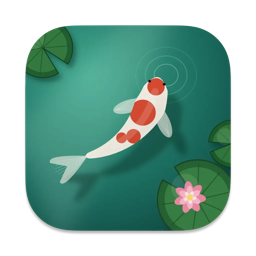
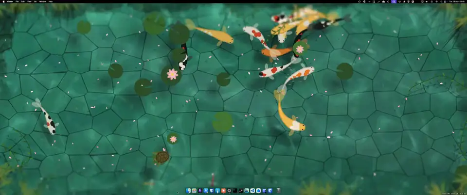

<p align="center">
  
</p>

<h1 align="center">PondWall</h1>

<p align="center">
  A living koi pond as your macOS wallpaper.<br>
</p>

<p align="center">
  <a href="https://github.com/nacasha/Pondwall/releases/latest"><b>Download for macOS</b></a>
  &nbsp;·&nbsp; macOS 13 Ventura or later &nbsp;·&nbsp; Apple Silicon &amp; Intel
</p>

<p align="center">
  
</p>

---

## Features

- **A pond that lives:** koi glide and school, small fish follow them, dragonflies hover and dart, a frog hops between lily pads, and a turtle climbs onto a pad to rest now and then.
- **Weather and seasons:** rain showers, storms with lightning, wind that ripples the water and sways the reeds, falling petals, leaves or snow, and fireflies at night.
- **Time of day:** follow your Mac's clock, cycle through a whole day, or pin a fixed time from dawn to night.
- **Interactive mode:** click to drop koi food and watch the nearest fish swim over to eat it.
- **Styles and presets:** optional Painterly, Ink wash or Pixel art styles and a tilt-shift blur, plus built-in looks like *Golden sunset*, *Thunderstorm*, *Rainy night* and *Zen minimal*. Save your own presets too.
- **Easy on your battery:** rendering pauses whenever the wallpaper is covered, the screen is locked, or the Mac is asleep. You can also cap the frame rate.
- **Every display:** one pond per screen, on every Space.

## Install

1. Download `PondWall.dmg` from the [latest release](https://github.com/nacasha/Pondwall/releases/latest).
2. Open it and drag **PondWall** into **Applications**.
3. Launch PondWall. It lives in the menu bar and has no Dock icon.

The app is signed and notarized by Apple, so it opens without Gatekeeper warnings.

## Usage

Click the PondWall icon in the menu bar:

| Menu item | What it does |
| --- | --- |
| **Pause / Resume** | Stop or restart the animation. |
| **Settings… (⌘,)** | Tune the koi, creatures, plants, weather, water, style and performance, or apply a preset. |
| **Interactive** | Lets the pond take clicks so you can feed the koi. Desktop icons are hidden while it's on. |
| **Quit PondWall** | Quit. |

Turn on **Start at login** in Settings to keep the pond running.

## Build from source

Requires the Xcode Command Line Tools (`xcode-select --install`).

```sh
./build.sh                 # build a universal app and install it to ~/Applications
ARCHS=arm64 ./build.sh     # faster: build only for your Mac's chip
./make-dmg.sh              # build the installer at dist/PondWall.dmg
```

`build.sh` takes an optional output folder, and restarts PondWall if it's running. To sign for distribution, set `SIGN_IDENTITY` to your Developer ID Application identity:

```sh
SIGN_IDENTITY="Developer ID Application: Your Name (TEAMID)" ./make-dmg.sh
```

`make-dmg.sh` scripts Finder to lay out the installer window, so the first run asks for permission to control Finder.

## Releases

Both workflows run manually from the **Actions** tab, in this order:

1. **[Build macOS installer](.github/workflows/build.yml):** choose `patch`, `minor` or `major` to bump the version in `Info.plist`, or `manual` and type one, e.g. `1.2.0`. It builds a signed, notarized DMG with that version and uploads it as a workflow artifact to test.
2. **[Release](.github/workflows/release.yml):** publishes the DMG from the last successful build on `main` as-is. It commits that version to `Info.plist`, tags it `vX.Y.Z`, and marks it as the latest GitHub release.

Both use the `release` environment, which needs these secrets:

| Secret | Value |
| --- | --- |
| `MACOS_CERTIFICATE` | Developer ID Application certificate exported as `.p12`, base64-encoded |
| `MACOS_CERTIFICATE_PWD` | Password of that `.p12` |
| `APPLE_ID` | Apple ID email used for notarization |
| `APPLE_TEAM_ID` | Apple Developer team ID |
| `APPLE_APP_PASSWORD` | App-specific password for that Apple ID |
